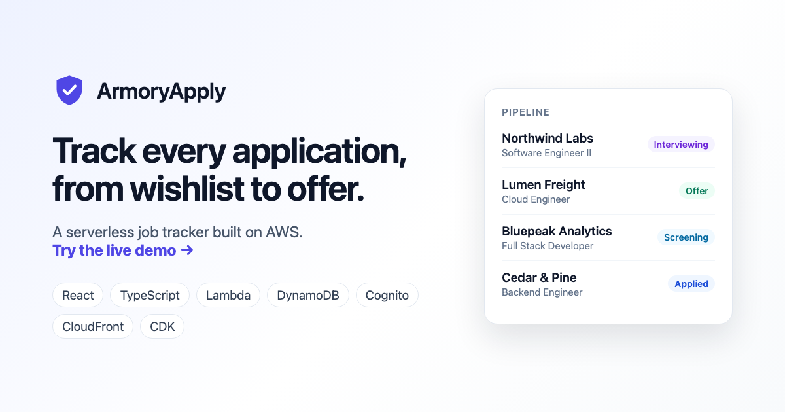
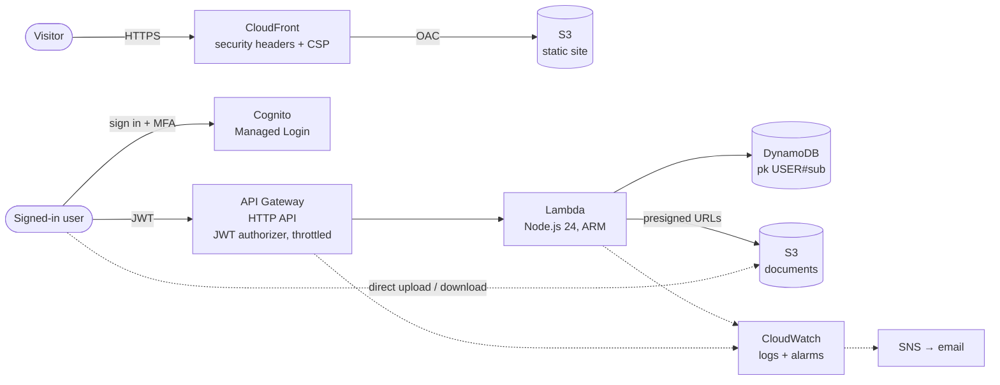

# ArmoryApply

A job application tracker built as a hands-on, production-style AWS serverless project: invite-only accounts,
MFA, a JWT-protected API, per-user data isolation, direct-to-S3 file uploads, and monitoring, all defined as
infrastructure as code.

**Live demo:** https://d1iqw1qv83zyx7.cloudfront.net/demo (sample data, no account needed)



## What it does

- Track applications from wishlist to offer: company, role, status, salary range, location, job link, notes
- Folders (multi-label, like Gmail labels), an interview timeline, and a pipeline dashboard
- Attach a resume and cover letter to each application, and preview PDF and Word files in the app
- Invite-only accounts: an admin invites people, and each user sees only their own data
- Users can delete their account, which erases their records, files, and login

The app has two halves that share the same UI:

| | Public demo (`/demo`) | Private app (`/app`) |
|---|---|---|
| Who | Anyone | Invited users, signed in with MFA |
| Data | Sample data in the visitor's browser (localStorage) | DynamoDB + S3, isolated per user |
| AWS calls | **None** | API Gateway → Lambda |

Pages talk to a `DataSource` interface; `DemoDataSource` and `ApiDataSource` implement it, so the UI never knows
which one it's using.

## Architecture



- **Frontend:** React, TypeScript, Vite, Tailwind, TanStack Query (one cached list serves every page)
- **Hosting:** private S3 bucket behind CloudFront with Origin Access Control
- **Auth:** Cognito user pool, OAuth 2.0 authorization code flow with PKCE, Managed Login (branded)
- **API:** API Gateway HTTP API with a Cognito JWT authorizer and stage throttling → one Lambda function
- **Data:** DynamoDB single-table design (`pk = USER#<sub>`, `sk = APP#<id>`), on-demand, point-in-time recovery
- **Files:** private S3 bucket, presigned POST uploads and presigned GET downloads
- **Ops:** CloudWatch alarms → SNS email, API access logs, log retention, AWS Budgets
- **IaC:** AWS CDK (TypeScript), two stacks: `ArmoryApply-Site` and `ArmoryApply-Backend`

## Security

| Concern | How it's handled |
|---|---|
| Who can get in | Self-sign-up disabled; accounts exist only by admin invite. MFA (authenticator app) required, passwords of 12+ characters. The site never handles passwords (Cognito Managed Login). |
| Who can call the API | Every route requires a valid Cognito access token; API Gateway rejects bad tokens before any code runs. |
| Seeing other users' data | The user ID comes from the verified token (`sub`), never from the request. All data is keyed under it. |
| Admin actions | A Cognito group (`admins`) carried in the signed token, enforced server-side, never just by hiding UI. |
| Bad input | Server-side validation with field allow-listing and length limits shared with the frontend. |
| File uploads | Presigned POST policy enforces 1 byte–5 MB and an exact content type (PDF/Word), so S3 rejects tampered uploads itself. Uploads go to `pending/` (1-day lifecycle) and are promoted only after verification, which prevents orphaned files. |
| File access | 5-minute presigned GET links, scoped to the caller's own prefix and checked against their record. |
| Least privilege | The Lambda role lists exactly the 10 DynamoDB and S3 actions and 5 Cognito actions it uses, each on one resource. |
| Abuse and cost | API throttling (10 req/s, burst 20), a cap on the number of accounts, AWS Budgets alert, and alarms on errors, 4xx spikes, and traffic spikes. |
| Browser hardening | Content-Security-Policy (`script-src 'self'`, allow-listed API/Cognito/S3 origins), HSTS, `X-Frame-Options`, `nosniff`, Permissions-Policy. |
| Data at rest | S3 and DynamoDB encryption, Block Public Access, HTTPS-only bucket policies. |
| Privacy | A plain-language [privacy page](https://d1iqw1qv83zyx7.cloudfront.net/privacy) and self-service account deletion. |

## Cost

Built to run at about **$0/month** for personal use: everything is serverless and pay-per-request. Demo visitors
only download static files from CloudFront and never touch the backend. Unauthenticated API calls are rejected by
API Gateway before Lambda runs.

## Repository layout

| Path | Contents |
|---|---|
| `frontend/` | React app: `pages/`, `components/`, `data/` (DataSource implementations), `private/` (sign-in, account) |
| `infra/bin/` | CDK entry point |
| `infra/lib/site-stack.ts` | S3 + CloudFront + security headers |
| `infra/lib/backend-stack.ts` | Cognito, DynamoDB, Lambda, API Gateway, documents bucket, alarms |
| `infra/lambda/` | API handler: `api.ts` (routes), `documents.ts` (files), `accounts.ts` (invites, deletion), `validate.ts` |
| `infra/branding/` | Cognito Managed Login style and logo |

## Running it

```bash
# Frontend (the demo works with no AWS at all)
cd frontend && npm install && npm run dev        # http://localhost:5173/demo
```

Deploying needs an AWS account and the CDK. Create `infra/.env` with `ALERT_EMAIL=you@example.com`, then:

```bash
cd infra && npm install
npx cdk bootstrap                # once per account/region
npm run deploy:backend           # Cognito, API, database, files, alarms
npm run deploy                   # builds the frontend and publishes the site
```

After the first backend deploy, copy its outputs into `frontend/src/config.ts` and `infra/bin/armoryapply.ts`.

## Roadmap

- [x] Scaffold, data model, and full UI on demo data
- [x] S3 + CloudFront hosting with CDK
- [x] Cognito sign-in with MFA
- [x] API Gateway + Lambda + DynamoDB
- [x] Resume and cover letter storage in S3 (presigned URLs)
- [x] Invite-only accounts, account deletion, privacy page
- [x] Hardening: alarms, access logs, least-privilege IAM, CSP, branded sign-in
- [ ] **Import from link:** paste a job posting URL, and a Lambda extracts the details (schema.org JobPosting,
      Greenhouse/Lever public APIs) into a pre-filled form, with SSRF protections
- [ ] Optional: CI/CD with GitHub OIDC, custom domain
